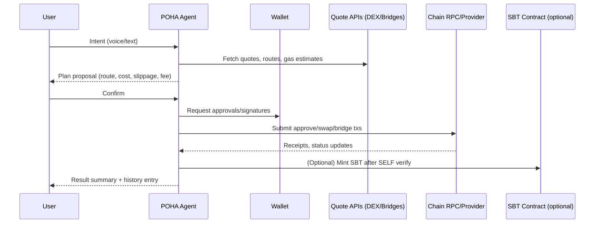

# POHA Agent — The On‑Chain Intent Assistant

Make any on‑chain action simple and programmable. POHA Agent interprets voice/text intents, plans safe routes, executes swaps and bridges, and verifies outcomes — all while keeping users in control and routing configurable fees to a treasury.

Contents
- What is POHA Agent?
- Key Innovation
- How It Works (Flow)
- Safety & Economic Model
- Use Cases
- Potential Limitations
- Mitigation Strategies
- Core Philosophy
- Example Agent Prompts
- Integration Points
- Challenges & Learnings

## What is POHA Agent?
An autonomous, privacy‑respecting assistant that turns human intents into on‑chain transactions. It connects wallets, optionally verifies identity (SELF), selects optimal routes from DEX aggregators and bridges, manages approvals, submits transactions, monitors confirmations, and summarizes results.

## Key Innovation
- Intent-first UX: speak or type what you want; the agent plans and executes.
- Multi-rail execution: same‑chain swaps and cross‑chain bridges with automatic fallbacks.
- Optional identity: integrate SELF verification and SBT mint for gated features.
- Treasury-aware: configurable micro‑fees to a public treasury address.
- Explainability: previews routes, costs, and risk before you confirm.

## How It Works (Flow)

## Safety & Economic Model
- Consent-gated execution: all write operations require explicit user confirmation.
- Bounded risk: slippage limits, min‑output guards, allowance scoping.
- Fees: small, configurable fee to `NEXT_PUBLIC_TREASURY_ADDRESS`; transparent in previews.
- Monitoring: detects pending/replaced/failed states and suggests remediations (e.g., re‑try, speed‑up).

## Use Cases
- “Swap and bridge” assistants for cross‑ecosystem portfolios.
- Automated payouts and periodic rebalancing across chains.
- Gated features for verified users (via SELF + SBT).
- Treasury operations: skim fees, track flows, export histories.

## Potential Limitations
- RPC and route provider reliability may vary by chain.
- Token approvals and gas constraints can block execution.
- Quote freshness in volatile markets.

## Mitigation Strategies
- Provider failover and exponential backoff on transient errors.
- Pre‑flight checks for balances, allowances, and route availability.
- Re‑quote on staleness; warn when market moves exceed threshold.

## Core Philosophy
Agentic, transparent, and user‑consented. Every action explained, every risk bounded, every transaction traceable.

## Example Agent Prompts
- “Swap 50 USDC to ETH on Base with max 0.5% slippage.”
- “Bridge 20 USDC from Arbitrum to Optimism and notify me when done.”
- “Verify me with SELF and mint the SBT.”
- “Send 5 PYUSD to the treasury for fees.”
- “Show my last 5 transactions and any pending ones.”

## Integration Points
- Env config: set `OPENAI_API_KEY`, `RPC_URL`, `PRIVATE_KEY`, `SBT_CONTRACT`, `NEXT_PUBLIC_TREASURY_ADDRESS` in root `.env`.
- Frontend: `src/components/VoiceAssistant.tsx`, `src/components/*`, `src/app/verify/page.tsx`.
- Backend: `src/app/api/*`, `packages/widget/src/api/*` for intent processing (OpenAI), swaps transcribe, and verify routes.
- Contracts: `sbt-contract/*` for SBT minting after SELF verification.

## Challenges & Learnings
- Time management: designing flows, env unification, and docs while shipping features required tight prioritization.
- Reliability: added fallback routes and monitoring to reduce user friction during demos.
- Clarity: previews and confirmations are critical for trust in agent execution.
