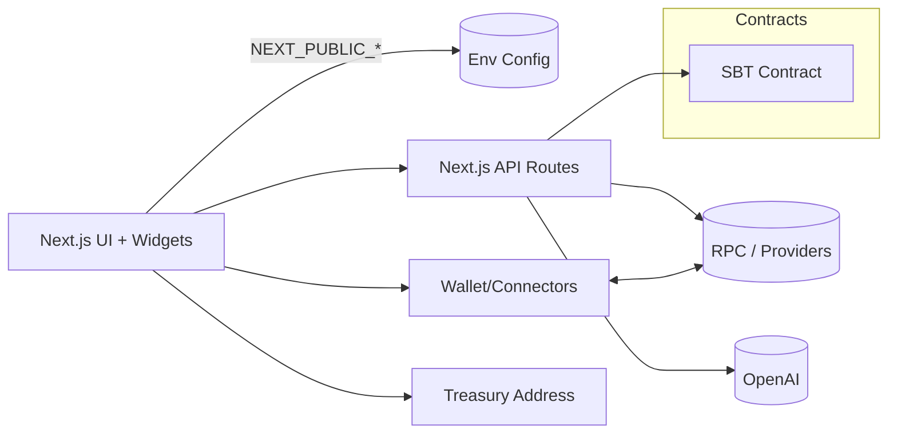
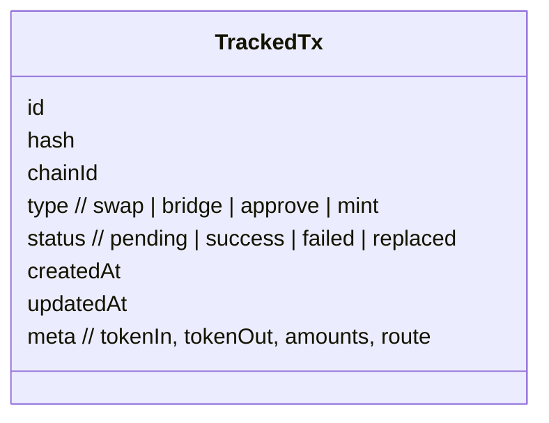

# POHA Agent — Project Guide

This guide explains POHA Agent’s end-to-end flow, use cases, wallet feature extensions, automation strategies (swaps and bridges), and monitoring. It includes flow diagrams and example prompts for demos or development.

Contents
- Problem & Vision
- End-to-End Flow
- Architecture
- Wallet Feature Extensions
- Automating Swaps & Bridges
- Wallet Monitoring

## Problem & Vision
People want a single, smooth experience to verify their identity, connect any wallet, swap assets, bridge across chains, and pay small fees to a treasury — without juggling multiple dapps or manual steps. POHA Agent provides an intent-driven assistant that automates these actions safely and transparently.

## End-to-End Agent Flow
```mermaid
flowchart TD
  A[User states intent (voice/text)] --> B[Connect wallet]
  B --> C{Optional SELF verify}
  C -->|Verified| D[Mint SBT (optional)]
  C -->|Skip| E[Proceed without SBT]
  D --> E
  E --> F[Agent plans route]
  F --> G{Same or cross chain?}
  G -->|Same chain| H[Swap]
  G -->|Cross chain| I[Bridge]
  H --> J[Fee to Treasury]
  I --> J
  J --> K[Record tx + history]
  K --> L[Notify user + monitor]
```

Key interactions
- Connect: primary CTA for wallet connection.
- Verify: optional flow using SELF; mints an SBT when enabled.
- Swap/Bridge: agent proposes route, estimates gas, gets approval.
- History: on-chain txs with status updates.
- Assistant: voice/text commands to automate complex intents.

## Architecture


Environment keys
- Public: `NEXT_PUBLIC_BASE_URL`, `NEXT_PUBLIC_TREASURY_ADDRESS`, `NEXT_PUBLIC_SELF_*`
- Server: `OPENAI_API_KEY`, `RPC_URL`, `PRIVATE_KEY`, `SBT_CONTRACT`, `MINT_SBT`, `SELF_MAINNET`

Relevant files
- UI flows: `src/app/verify/page.tsx`, `src/components/*`
- API routes: `src/app/api/*`, `packages/widget/src/api/*`
- Contracts: `sbt-contract/*`
- Env: root `.env` and `.env.example`

## Wallet Feature Extensions
- Multi-wallet support: Injected, WalletConnect, embedded smart accounts as roadmap.
- ENS resolution: resolve ENS names to addresses on connect and inputs; display primary ENS on UI when present.
- Session management: auto-reconnect, remember last-used chain; denylist risky chains.
- Gas abstraction (roadmap): sponsor or pre-fund fees for verified users or specific routes.
- Fee policy: a small, configurable fee sent to `NEXT_PUBLIC_TREASURY_ADDRESS` on swap/bridge.

## Automating Swaps & Bridges
Automation entry points
- UI: quick actions and saved routes.
- Voice/Text Assistant: interpret intents (e.g., “Bridge 20 USDC from Base to Optimism and keep 2 USDC for gas”).
- Backend tasks: sanity checks, rebroadcast stuck txs, notify on failures.

Routing strategy
- Same-chain: pick best DEX route by liquidity and slippage tolerance.
- Cross-chain: select a reliable bridge with quote and ETA; fallback to secondary if quote or RPC fails.

Pre-flight checks
- Balance and allowance; prompt/auto-send approval.
- Route availability by chain; warn if maintenance or degraded RPC.
- Fee estimation; enforce min-output vs. slippage.

Resilience
- Retry with exponential backoff on transient RPC errors.
- Idempotent job keys for automation tasks.
- Store tx hash and provider so monitoring can reconcile later.

## Wallet Monitoring
Goals
- Keep users informed of tx states.
- Detect anomalies (stuck, replaced, failed).
- Maintain a clean history with statuses and links to explorers.

Signals
- Pending → Mined transitions via provider listeners.
- Replacement detection (speed-up/cancel).
- Reorgs and finality threshold per chain.

Notifications
- UI toasts and history list updates.
- Optional webhooks or email for long-running bridges (roadmap).

Data model (conceptual)


## Example Prompts
Assistant (user)
- “Swap 50 USDC to ETH on Base with max 0.5% slippage.”
- “Bridge 20 USDC from Arbitrum to Optimism; notify me when done.”
- “Send 5 PYUSD to treasury for fees.”
- “Verify me with SELF and mint the SBT.”
- “Show my last 5 transactions and any pending ones.”

Dev/testing
- “Use RPC_URL=<your rpc> and PRIVATE_KEY=<your key>, then mint SBT for my wallet.”
- “Simulate a stuck tx and retry with higher gas.”
- “Resolve ‘vitalik.eth’ and swap 0.1 ETH to USDC on mainnet.”